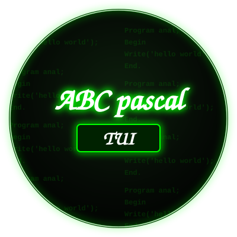

[](README.md)
[](README_RU.md)

---


## ОПИС

abc-pascal-tui — це IDE для Паскаля, заснована на компіляторі PascalABC.NET, що використовує TUI-інтерфейс на Python.

## ВИМОГИ

Перед встановленням IDE переконайтеся, що у вас встановлені Python, Mono, Git та бібліотека Textual. DotNet поки не обов'язковий (він потрібен для запуску бінарників, які некоректно працюють під Mono).

<p align="center">
  
</p>

<p align="center">
  
</p>

---

# Інструкція для Termux

```bash
pkg install mono -y
```

```bash
pkg install python -y
```

```bash
pkg install git -y
```

```bash
pip install textual
```

(Бажано встановити DotNet, але не обов'язково.)

```bash
pkg install dotnet-runtime-8.0
```

```bash
git clone https://github.com/kuzmak161-creator/abc-pascal-tui
```

```bash
cd abc-pascal-tui
```

Встановлення

Після клонування запустіть інсталятор з кореня репозиторію:

```bash
bash install.sh
```

Скрипт попросить вибрати мову (English / Русский / Українська), після чого:

· скопіює всі файли проекту (включно зі скриптом tui) до /usrshare/abc-pascal-tui (або $PREFIX/share/abc-pascal-tui у Termux, якщо задана змінна $PREFIX);
· створить команду pascal-tui у /bin (або $PREFIX/bin), яка запускає встановлений скрипт tui;
· видалить себе після успішного встановлення.

Після встановлення ви зможете запускати IDE з будь-якого місця командою:

```bash
pascal-tui
```

Налаштування будуть зберігатися в:

```
~/.config/abc-pascal-tui/settings.json
```

---

Інструкція для Debian

(Перевірено на ARM-версії та mx linux x86_64.)

```bash
sudo apt install mono-complete 
```

```bash
sudo apt install git -y
```

```bash
sudo apt install python3 -y
```

```bash
pip3 install textual
```

(Бажано встановити DotNet, але не обов'язково.)

```bash
sudo apt install dotnet-runtime-8.0
```

```bash
git clone https://github.com/kuzmak161-creator/abc-pascal-tui.git
```

```bash
cd abc-pascal-tui
```

Запустіть інсталятор:

```bash
bash install.sh
```

---

Команда для оновлення папки з IDE

```bash
cd ~/abc-pascal-tui && git pull
```

```bash
bash install.sh
```

В офіційних релізах оновлення виходять рідше.

---

Ліцензія

· Компілятор PascalABC.NET — GNU Lesser General Public License v3 (LGPL v3) https://github.com/pascalabcnet/pascalabcnet

Код інтерфейсу (tui) поширюється на умовах MIT License.

